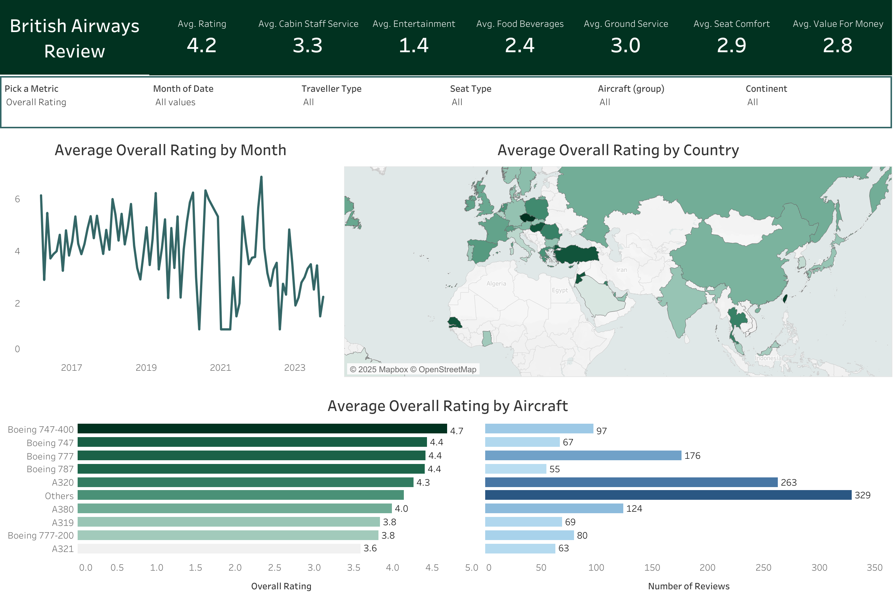

# 🧠 Data Analytics Portfolio by Sai Kalyan Nadella

Welcome! This repository features a curated collection of data analytics projects that demonstrate my ability to work with SQL, clean and transform datasets, and build actionable dashboards using Tableau and Looker Studio. Each project reflects a real-world scenario, from healthcare to airline reviews to housing markets.

---

## 📁 SQL Projects

### 1. ⚾ Baseball Last Pitch Analysis
- **Goal**: Analyze MLB final-pitch outcomes to understand player behavior and pitch effectiveness.
- **Skills**: CASE logic, grouping, aggregation.
- **File**: `Baseball_Last_Pitch.sql`

### 2. 🦠 COVID-19 Global Analysis
- **Goal**: Analyze infection and mortality trends globally using structured COVID data.
- **Skills**: Joins, window functions, subqueries.
- **File**: `Covid_Data_Exploration.sql`
- **Dashboard**: See below.

### 3. 🧹 Housing Data Cleaning
- **Goal**: Prepare a messy housing dataset for analysis by standardizing and cleaning values.
- **Skills**: TRIM, CASE, UPDATE, data normalization.
- **File**: `Data_Cleaning.sql`

---

## 📊 Dashboards

### 1. 🌍 COVID-19 Impact Dashboard – Tableau

- **Insights**: Shows total deaths by continent, infection rates by country, and time-based infection trends.
- **Link**: *Add Tableau Public link here if published*

---

### 2. ✈️ British Airways Review Dashboard – Tableau

- **Insights**: Tracks average ratings by month, region, and aircraft type based on traveler feedback.
- **Focus**: Service quality, entertainment, food, seat comfort across different flights and aircraft models.
- **Link**: *Add Tableau Public link here if published*

---

### 3. 🏠 King County Housing Market – Tableau

- **Insights**: Interactive dashboard showing sales prices, condition heatmaps, and distribution by bedrooms/bathrooms.
- **Focus**: Identify price trends by location and home features.
- **Link**: *Add Tableau Public link here if published*

---

### 4. 📦 Superstore Orders Report – Looker Studio

- **Source**: [Dashboard.pdf](./Dashboard.pdf)
- **Key Metrics**:
  - Orders by region and segment
  - Profit trends over years
  - High-performing states and products
- **Screenshot not embedded due to format**: Open the PDF in the repo to view visuals.

---

## 📄 Resume

- [Sai Kalyan Nadella_Resume.pdf](./Sai Kalyan_Nadella_Resume_C.pdf)

---

## 🛠 Tools & Skills Demonstrated

- **SQL (MS SQL Server)**
- **Data Cleaning & Wrangling**
- **Data Visualization**: Tableau, Looker Studio
- **Exploratory Data Analysis**
- **KPI Development & Insight Generation**
- **Storytelling with Data**

---

## 📬 Contact

- 📧 Email: [nskalyan9@gmail.com](mailto:nskalyan9@gmail.com)
- 🔗 LinkedIn: [linkedin.com/in/saikalyannadella](https://www.linkedin.com/in/saikalyannadella)

---

Thanks for checking out my work! Feel free to clone the repo, explore the queries, or reach out for collaboration or opportunities.

Link to Tableau Dashboards: https://public.tableau.com/app/profile/sai.kalyan6026/vizzes

Link to Looker Dashboard: https://lookerstudio.google.com/reporting/52671014-c131-41cb-bb86-22061b7c4774
